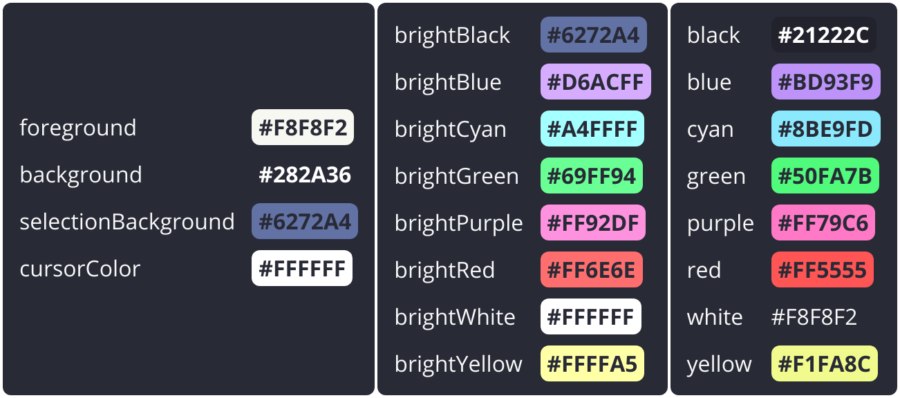

#  **Windows Terminal**: Dracula colors 🧛



## Installation
### Configure for all profiles
```powershell
.\setup.ps1 -ActivateForAllProfiles
```

### Configure for single profile
```powershell
.\setup.ps1 -ProfileName "PowerShell"
```